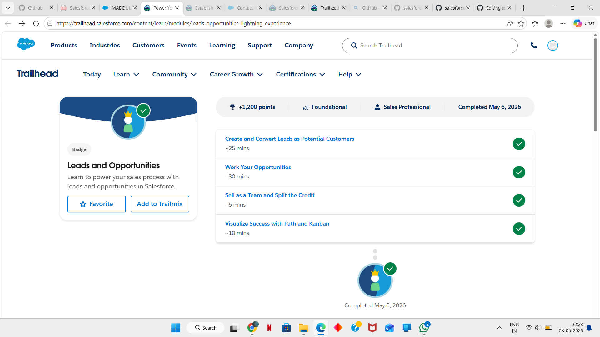
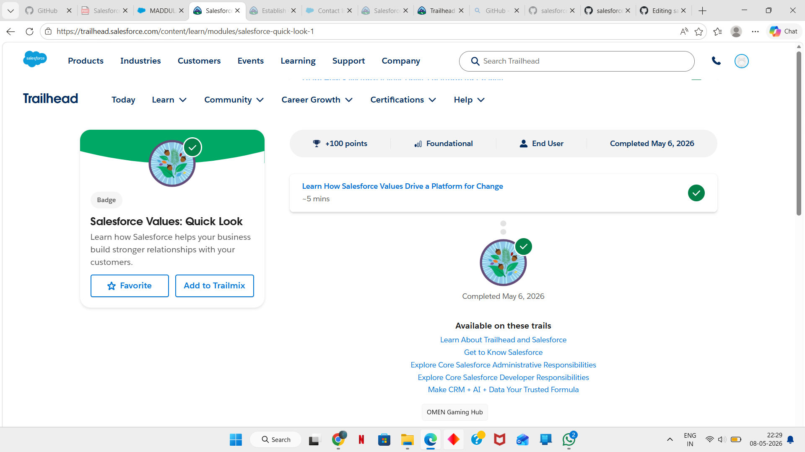

# Day 2 - Salesforce Platform Basics
## What I learned today
Today I learned about Leads and Opportunities in Salesforce and how they are used in the sales process. I also explored important Salesforce platform concepts like Apps, Objects, Tabs, Opportunity Teams, Path, and Kanban View.
## What is a Lead?
A Lead is a potential customer who has shown interest in a company’s product or service.

Leads can come from:
- Websites
- Advertisements
- Campaigns
- Events
- Referrals
### Important points about Leads
- Leads represent possible customers
- They contain basic customer information
- Leads can later be converted into Accounts, Contacts, and Opportunities
 ## What is an Opportunity?
An Opportunity represents a possible business deal with a customer.

It helps companies:
- Track sales progress
- Manage revenue
- Follow different sales stages
- Predict closing dates
### Important points about Opportunities
- Opportunities are used to manage sales deals
- They move through different stages until the deal is closed
- Revenue and expected close dates can be tracked
 ## Difference between Lead and Opportunity

| Lead | Opportunity |
|------|-------------|
| Potential customer | Potential sales deal |
| Early stage | Sales process stage |
| Can be converted later | Tracks deal progress |
 ## Salesforce Platform Basics
 ### What is an App?
An App in Salesforce is a collection of tools, tabs, and features grouped together for a specific business purpose.
 ### Examples of Apps
- Sales App
- Service App
- Marketing App
 ### What is an Object?
Objects are used to store data in Salesforce.

There are two types of objects:
- Standard Objects
- Custom Objects
### Examples of Standard Objects
- Account
- Contact
- Opportunity
### Examples of Custom Objects
- Student
- Attendance
- Library Record
### What is a Tab?
Tabs help users access Salesforce features and records easily.
### Examples of Tabs
- Accounts Tab
- Contacts Tab
- Leads Tab
- Opportunities Tab
## Opportunity Teams
Opportunity Teams allow multiple users to work together on the same sales opportunity.

Different team members can have:
- Different roles
- Different responsibilities
- Different access permissions

This helps improve teamwork and collaboration during the sales process.
## Opportunity Splits
Today I learned that opportunity credit can be divided in different ways.
### Revenue Split
Used for team members directly responsible for generating revenue.
### Overlay Split
Used for supporting team members who contributed indirectly to the opportunity.
## Path and Kanban View
### Path
Path helps users track progress through different stages of the sales process.
### Benefits of Path
- Tracks progress step by step
- Provides guidance for each stage
- Makes the workflow easier to understand
### Kanban View
Kanban View displays records visually in columns based on stages.
### Benefits of Kanban View
- Easy to manage opportunities
- Drag and drop records between stages
- Better visual understanding of workflow
## Configuration vs Coding
### Configuration
Configuration means customizing Salesforce using clicks instead of code.
### Examples
- Creating objects
- Creating fields
- Creating workflows
### Coding
Coding is used when advanced customization is required.
### Examples
- Apex Programming
- Lightning Web Components
- Custom integrations
## Simple System Design Understanding
### College Management System
#### Objects
- Student
- Faculty
- Course
- Attendance
#### Workflow
- Students register for courses
- Faculty update attendance
- Admin manages records

This helped me understand how Salesforce can be used to build real-world business systems.
## What I Understood Today
Today’s learning helped me understand how Salesforce manages the complete sales process starting from Leads to Opportunities. I also learned how Salesforce platform features like Apps, Objects, Tabs, Path, and Kanban View help companies organize and manage their workflows efficiently.
## My Thoughts
The concepts are becoming more practical now. I’m slowly understanding how Salesforce is used in real business environments for customer management, teamwork, sales tracking, and workflow management.
 ## Screenshots
### Leads and Opportunities

### Leads and Opportunity Assessment

### Opportunity Team Quiz

### Path and Kanban Quiz

### Salesforce Values

