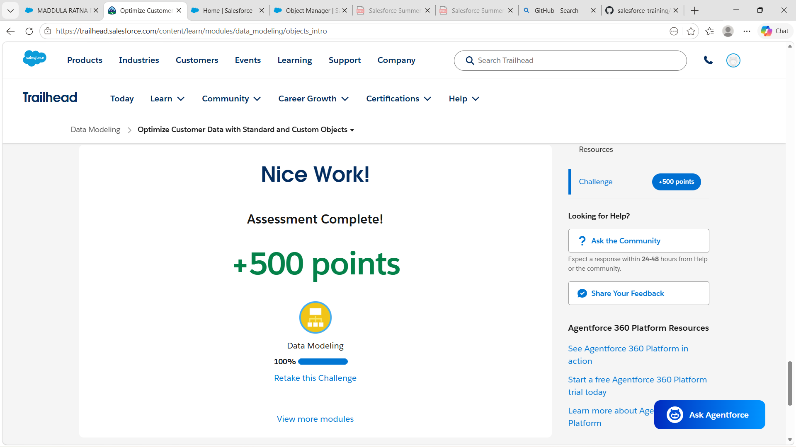
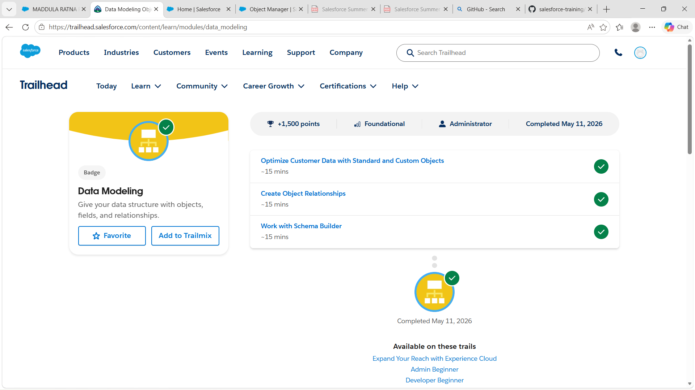
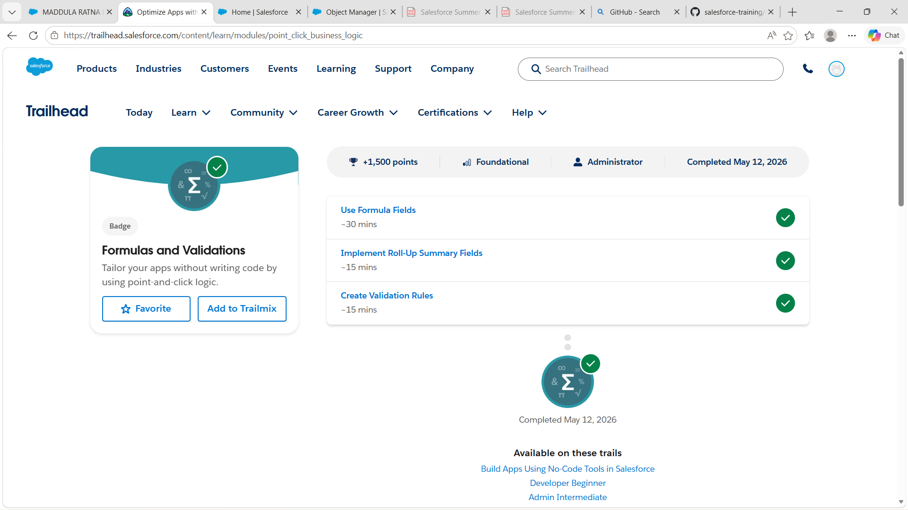
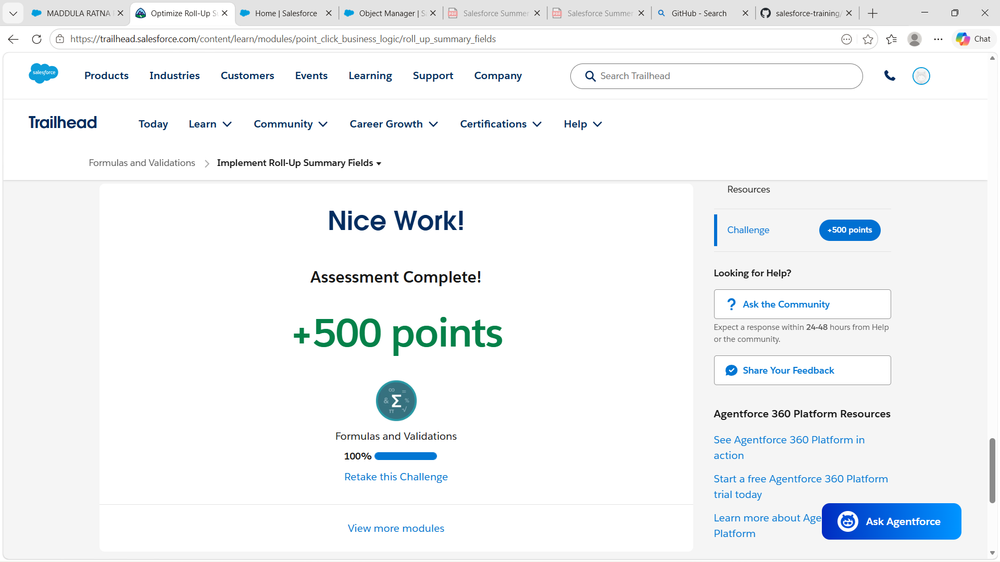
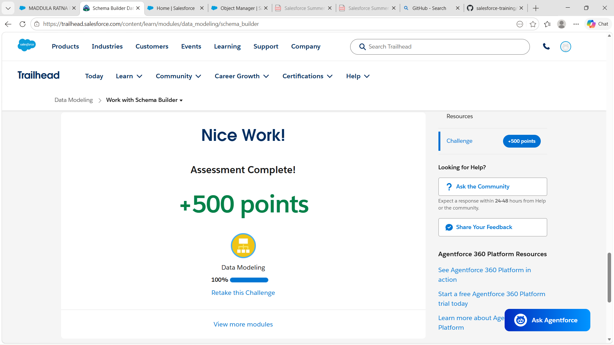
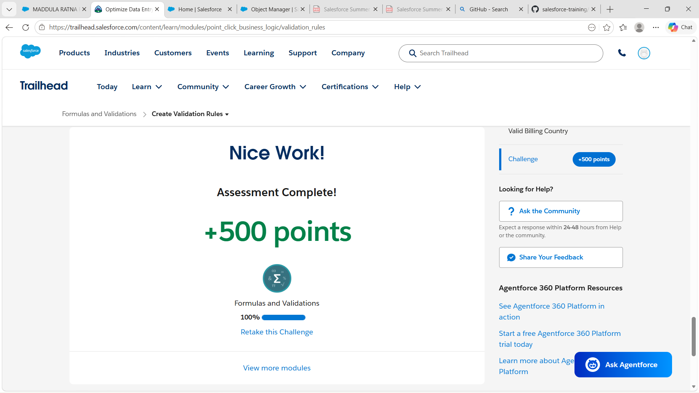

# Day 3 -  Data Modeling
## What I learned today
Today I learned about Data Modeling in Salesforce and how businesses organize their data in a structured way. I understood the importance of objects, relationships, formula fields, and validation rules. Compared to the previous topics, this felt more connected to real-world systems because everything depends on properly managed data.
 # 1. Difference Between App, Object, Record, and Field
## App
An App in Salesforce is a collection of related features, tabs, and tools used for a particular purpose.
Example:
Sales App or Service App
 ## Object
An Object is similar to a database table that stores related information.
Example:
Student, Faculty, Course
## Record
A Record is a single entry inside an object.
Example:
One student’s details inside the Student object.
## Field
A Field stores specific information about a record.
Example:
Student Name, Email, Phone Number
# 2. Standard Objects vs Custom Objects
| Standard Objects | Custom Objects |
|------------------|----------------|
| Already available in Salesforce | Created based on business needs |
| Provided by Salesforce | Created by users/admins |
| Example: Account, Contact | Example: Student, Faculty |
From my understanding, standard objects are common CRM objects already built into Salesforce, while custom objects are created when a company needs something specific for their own system.
# 3. College Management System Data Model
For this task, I designed a simple College Management System.
## Objects Created
- Student
- Faculty
- Course
- Department
## Relationships Between Objects
### Department → Faculty
One department can have many faculty members.
Relationship Used:
Lookup Relationship
### Department → Course
One department can manage multiple courses.
Relationship Used:
Lookup Relationship
### Course → Student
One course can contain many students.
Relationship Used:
Lookup Relationship
### Faculty → Course
One faculty member can teach multiple courses.
Relationship Used:
Lookup Relationship
## My Understanding About Relationships
Relationships are very important because they connect related data together. Instead of storing the same information again and again, Salesforce links records between objects which makes the system more organized and easier to manage.
# 4. Formula Fields
## 1. Full Name
This field combines First Name and Last Name automatically.
Why should it be automatic?
It saves time and avoids typing mistakes.
## 2. Remaining Seats
Formula:
Total Seats - Enrolled Students
Why should it be automatic?
The value updates automatically whenever student enrollment changes.
## 3. Percentage
Formula:
(Obtained Marks / Total Marks) * 100
Why should it be automatic?
Manual calculations can create errors, so automation improves accuracy.
# 5. Validation Rules
## 1. Email Cannot Be Empty
This prevents users from saving records without email addresses.
## 2. Student Age Cannot Be Negative
This avoids invalid age values in the system.
## 3. Course Seats Cannot Exceed Limit
This prevents adding more students than the available course capacity.
# 6. Reflection
From today’s learning, I understood why companies use structured systems instead of random Excel sheets. When data becomes very large, spreadsheets become difficult to manage and errors can easily happen.
Salesforce solves this problem by organizing data using objects, relationships, automation, and validation rules. Structured data helps companies work more efficiently, maintain accuracy, and generate proper reports without confusion.
I also realized that Formula Fields and Validation Rules are very useful because they reduce manual work and help maintain clean and reliable data.
# Reflective Questions
## 1. Why can’t companies manage everything using Excel sheets?
Excel sheets become difficult to manage when the amount of data increases. There can be duplicate records, mistakes, and data security problems.
## 2. Why are relationships important between objects?
Relationships connect related records and make the system more organized.
## 3. What problems happen if data is inconsistent?
It can lead to wrong reports, duplicate records, confusion, and poor decision-making.
## 4. Why should repetitive calculations be automated?
Automation saves time, improves accuracy, and reduces manual effort.
## 5. Why should invalid data be blocked early?
It helps maintain clean data and prevents future problems in the system.
## 6. Why is Salesforce called a metadata-driven platform?
Because Salesforce allows customization of apps, objects, fields, and processes without requiring heavy coding.
# Screenshots
## Custom Objects

## Data Modeling

## Formula Fields

## Formulas and Validations

## Object Relations

## Roll Up Summary Fields

## Schema Builder

## Validation Rules

# My Thoughts
Today’s topic felt more practical and interesting because I could understand how real business systems are designed internally. I’m slowly starting to understand how Salesforce handles large amounts of business data in an organized and efficient way.
